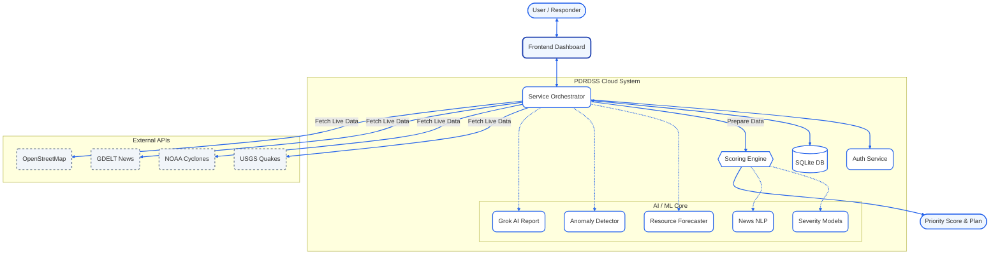

# PDRDSS System Architecture

## High-Level Architecture (Corrected)

## Component Details

### 1. Frontend Layer
- **Landing Page**: Real-time visualization of USGS earthquakes and NOAA cyclones.
- **Dashboard**: Main command center for running specific disaster analyses.
- **History/Analytics**: Reviewing past logs and aggregated statistics.

### 2. AI/ML Core (`ml_models/`)
This is the system's intelligence engine, replacing hardcoded rules:
- **Severity Classifiers (RandomForest)**: Two separate models for Earthquakes (Mag/Depth) and Cyclones (Wind/Pressure).
- **Resource Forecaster (GradientBoosting)**: 10 regression models predicting specific relief item quantities based on severity and population.
- **News Urgency (DistilBERT)**: Zero-shot NLP classification of disaster news.
- **Anomaly Detection (IsolationForest)**: Unsupervised learning to flag statistical outliers in live feeds.
- **Grok AI (LLM)**: Generates human-readable situation reports via external API.

### 3. Backend Services
- **FastAPI**: Async request handling.
- **Scoring Engine**: Computes weighted priority: `0.4*Severity + 0.3*Pop + 0.2*Res + 0.1*News`.
- **Orchestration**: Aggregates data from 5+ external sources in parallel using `httpx`.
