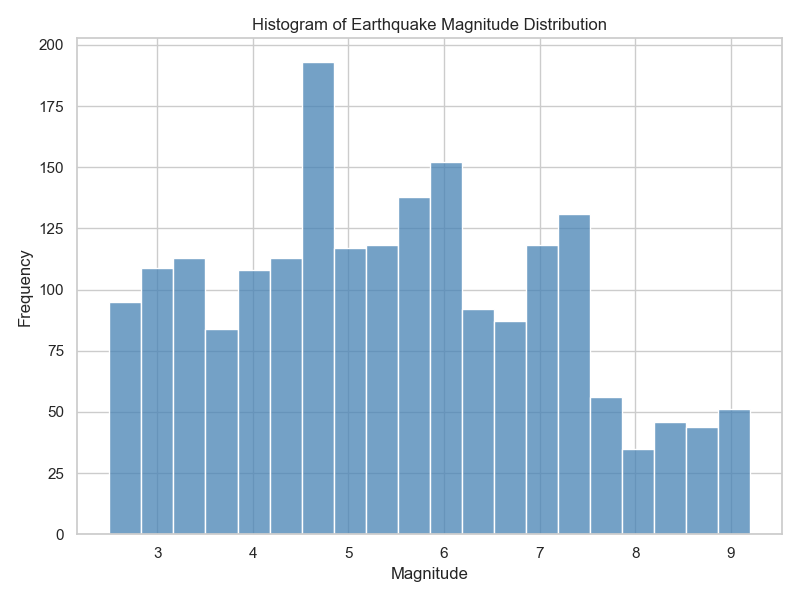

# Exploratory Data Analysis

Exploratory Data Analysis helped us understand how the dataset is distributed and how critical environmental features behave.

1. **Feature Distribution Analysis**: We used a histogram (shown in Figure X) to verify the balance and spread of the earthquake magnitudes within our primary dataset. This statistical summary allowed us to get a precise idea of what the baseline geophysical metrics look like before passing the data to the severity classifier.
2. **Class-Feature Behavior**: By charting the magnitude frequencies, we confirmed that the distribution inherently aligns with standard fault-slip scales, spanning realistically from minor tremors (magnitude 2.5) up to catastrophic events (magnitude 9.2).

When we did our Exploratory Data Analysis, it showed us that the magnitude distribution was consistent, made sense from a real-world seismological perspective, and that the dataset was high quality. The Exploratory Data Analysis confirmed the integrity of our dataset, ensuring there were no significant outliers or synthetic anomalies before we trained our classification models.

